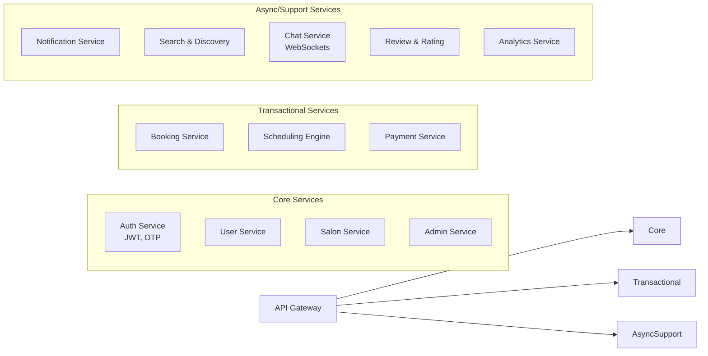
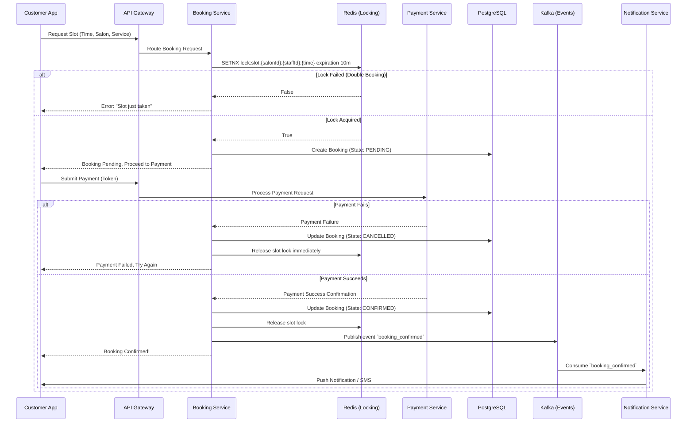
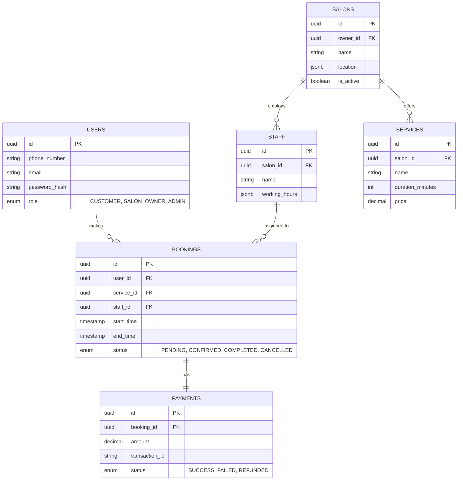
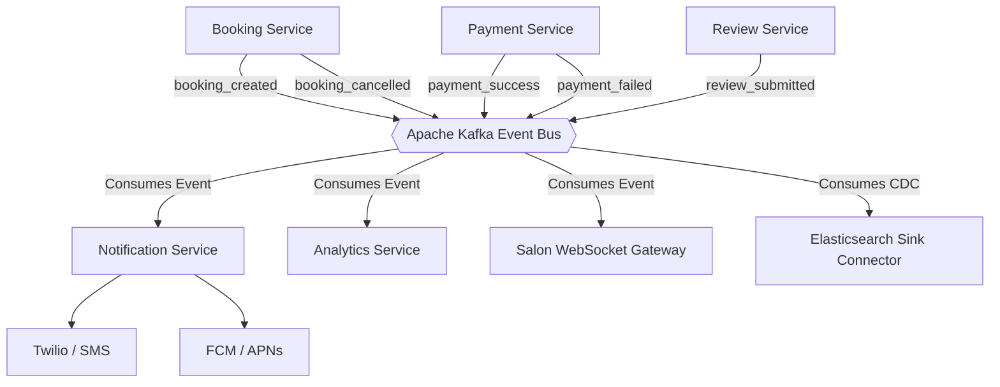

# System Architecture Document: Glowup (Salon Aggregator Platform)

This document outlines the production-grade, scalable system architecture for **Glowup**, a real-time platform connecting customers with multi-branch salons.

## 1. High-Level Architecture Overview

The platform uses a microservices architecture to ensure independent scaling of high-traffic domains (like Search and Booking). 

```mermaid
graph TD
    %% Clients
    Mobile[Customer Mobile App\nReact Native]
    WebSalon[Salon Dashboard\nReact/Next.js]
    WebAdmin[Admin Panel\nReact/Next.js]

    %% Edge
    CDN[CDN / CloudFront\nImages & Static Assets]
    LB[Load Balancer]
    WAF[Web Application Firewall]

    %% Gateway
    Gateway[API Gateway\nRate Limiting, Auth, Routing]

    %% Message Broker
    Kafka[{Apache Kafka / RabbitMQ\nEvent Bus}]

    %% Databases
    Postgres[(PostgreSQL\nPrimary DB)]
    Mongo[(MongoDB\nLogs/Reviews)]
    Redis[(Redis\nCache, Rate Limits, Slot Locks)]
    Elastic[(Elasticsearch\nSearch & Discovery)]
    S3[(S3 Object Storage\nMedia/Images)]

    %% Connections
    Mobile -.-> CDN
    Mobile -.-> WAF
    WebSalon -.-> WAF
    WebAdmin -.-> WAF
    CDN -.-> S3
    
    WAF --> LB
    LB --> Gateway
    Gateway --> Microservices((Microservices\nCluster))
    
    Microservices --> Postgres
    Microservices --> Mongo
    Microservices --> Redis
    Microservices --> Elastic
    Microservices --> Kafka
```

---

## 2. Service-Level Architecture

The Backend is decomposed into modular microservices. Initially deployed as containerized apps via Docker, coordinated with Kubernetes (EKS/GKE) for auto-scaling.



**Service Communication:**
- **Synchronous:** gRPC or REST for direct requests (e.g., Booking -> User Service to validate user).
- **Asynchronous:** Kafka for decoupled, non-blocking workflows (e.g., Booking Service -> Notification Service).

---

## 3. Booking System & Sequence Flow (CRITICAL)

The booking engine ensures highly concurrent slot assignment without double-bookings using **Distributed Locking (Redis)**.

### Slot Management Strategy
1. **Fetch:** Get available slots from PostgreSQL (joined with `Staff` and `Bookings`).
2. **Lock:** When a user selects a slot, acquire a lock in Redis with a TTL of 5-10 minutes. 
3. **Commit/Release:** If payment succeeds, write transaction to Postgres and release the lock. If payment fails or TTL expires, the lock is automatically released.

### Booking State Machine
`PENDING (Locked)` → `CONFIRMED (Paid)` → `IN-PROGRESS (At Salon)` → `COMPLETED` OR `CANCELLED`

### Booking Flow Sequence Diagram



---

## 4. Data Architecture & Schema

We adopt database-per-service (logical or physical) to prevent tightly-coupled schemas. 



**Database Polyglot:**
- **PostgreSQL:** Relational integrity for Financials, Users, Salons, and Bookings.
- **MongoDB:** Highly unstructured data logs, Review/Rating documents.
- **Elasticsearch:** Synced via Change Data Capture (Debezium + Kafka) from Postgres for geo-spatial spatial searches (e.g., "Find haircuts near me").

---

## 5. Event-Driven System

Asynchronous workflows decouple core transactional systems from auxiliary tasks.



---

## 6. Security Infrastructure

1. **API Security:** All requests run through API Gateway. Bearer JWT validation. Rate-limited by IP and UserID via Redis token-bucket algorithm to prevent DDoS.
2. **Data Security:** At-rest encryption (AES-256 for DB instances on AWS RDS). In-transit TLS 1.3. PII (Passwords) hashed via bcrypt.
3. **Payments:** Fully PCI-DSS compliant by offloading credit card capture to a payment provider (e.g., Stripe/Razorpay) via Drop-in UI. Backend only stores token references, never PAN data.
4. **RBAC:** Scoped permissions. Customers can only read/mutate their own `user_id` records.

---

## 7. Failure Scenarios & Mitigation Strategies

| Scenario | Mitigation Architecture |
| :--- | :--- |
| **Double Booking Attempt** | Redis `SETNX` lock handles instantaneous request races. Postgres Unique Constraints (`staff_id`, `start_time` overlap trigger) act as ultimate fallback barrier. |
| **Payment Failure** | Synchronous webhook response from Payment Gateway marks booking `CANCELLED` and triggers Kafka event to release the lock immediately to free up inventory. |
| **Server Crash during Booking** | Distributed Transactions utilize the Saga Pattern. If the pod dies mid-booking, the Redis lock TTL (10m) automatically expires, returning the slot to the system. |
| **Notification Provider Outage** | Kafka implements a Dead Letter Queue (DLQ). If Twilio/FCM is down, events are shifted to DLQ with exponential backoff and retries. |
| **Primary Database Downtime** | RDS Multi-AZ Deployment with automated failover. The Standby acts as Primary within 60-120 seconds. Redis cache serves read-heavy endpoints (like Search) to degrade gracefully. |